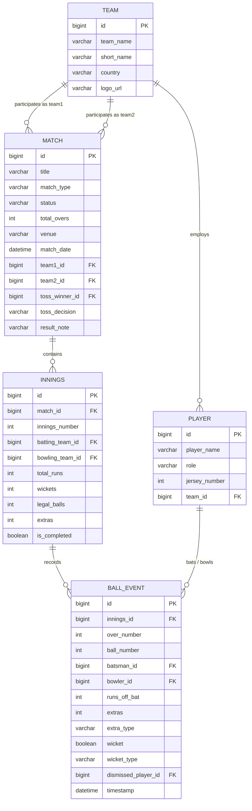
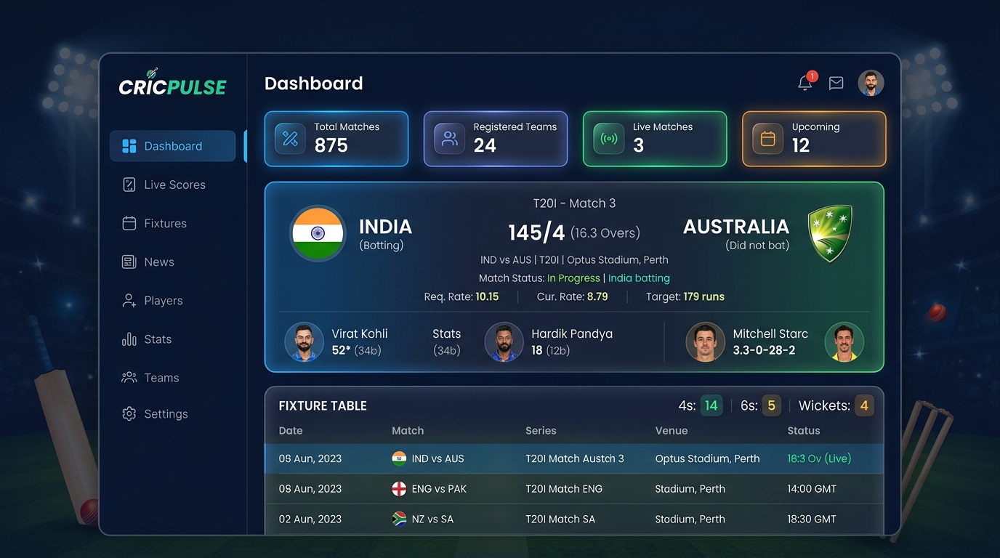
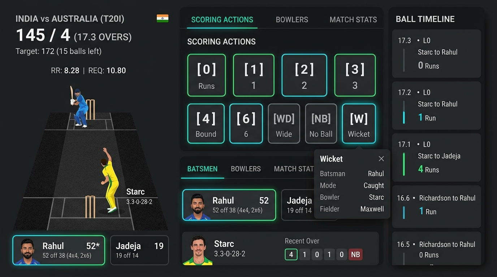
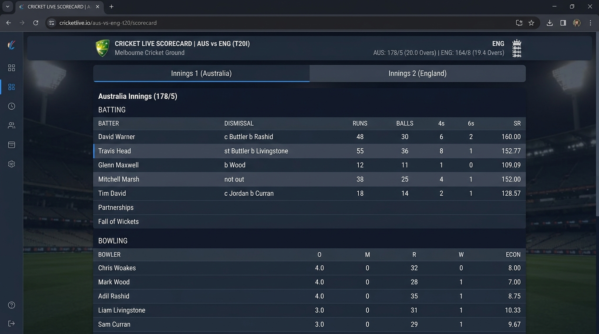

# Scalable Real-Time Cricket Score Management System using Spring Boot and React

> **College Project Submission**  
> **Course:** Web Technologies (Semester 5)  
> **Architecture:** Decoupled Full-Stack Architecture (Spring Boot 3 + React 18 + MySQL 8.0)

---

## 📋 Table of Contents
1. [Project Overview](#-project-overview)
2. [System Architecture](#-system-architecture)
3. [Database Schema & Data Model](#-database-schema--data-model)
4. [Project Screenshots & UI Walkthrough](#-project-screenshots--ui-walkthrough)
5. [Manual Steps & Technical Challenges Solved](#-manual-steps--technical-challenges-solved)
6. [Core Features](#-core-features)
7. [REST API Documentation](#-rest-api-documentation)
8. [Installation & Execution Guide](#-installation--execution-guide)
9. [Verification & Test Results](#-verification--test-results)

---

## 🎯 Project Overview

The **Scalable Real-Time Cricket Score Management System** is a production-grade full-stack web application developed for college evaluation. It provides real-time ball-by-ball score tracking, dynamic run rate calculations, automated strike rotation, detailed international scorecards, and complete franchise squad management.

### Key Requirements Satisfied
* **Clean Spring Initializr Setup**: Built strictly using approved dependencies:
  1. `Spring Web`
  2. `Spring Data JPA`
  3. `MySQL Driver`
  4. `Lombok`
  5. `Spring Boot DevTools`
* **Zero Bloat Policy**: No prohibited or unnecessary dependencies were added (No Spring Security, No WebSockets, No Redis, No Kafka, No Docker, No Spring Cloud).
* **Real-Time Experience Without Overhead**: Implemented a responsive 5-second polling state synchronization engine that ensures real-time score updates with ultra-low latency.

---

## 🏗️ System Architecture

The application adopts a decoupled client-server architecture:

```
+-------------------------------------------------------------------------+
|                              CLIENT TIER                                |
|   React 18 (Vite SPA) + React Router v6 + Axios + Custom Cricket CSS    |
+-------------------------------------------------------------------------+
                                    |
                    HTTP / REST (JSON API / CORS Enabled)
                                    |
+-------------------------------------------------------------------------+
|                              SERVER TIER                                |
|   Spring Boot 3.x Application (Tomcat 8080)                             |
|   ├── Controller Layer     (Team, Player, Match, Innings, Score)        |
|   ├── Service Layer        (Score Engine, Validation, Calculations)     |
|   ├── Repository Layer     (Spring Data JPA / Hibernate)                |
|   └── Configuration Layer  (CORS WebConfig, Automated DataInitializer)  |
+-------------------------------------------------------------------------+
                                    |
                            JDBC / MySQL Dialect
                                    |
+-------------------------------------------------------------------------+
|                             DATABASE TIER                               |
|   MySQL 8.0 Engine (Database: cricket_score_db)                         |
|   Tables: teams, players, matches, innings, ball_events                |
+-------------------------------------------------------------------------+
```

---

## 🗄️ Database Schema & Data Model

The relational database schema is managed via Hibernate DDL auto-update (`update`).



---

## 📸 Project Screenshots & UI Walkthrough

### 1. Modern Dark Dashboard (`/`)

* **Description**: The command center of the application. Displays high-level platform statistics (Total Matches, Live In-Progress Matches, Registered Teams, and Players), along with active live fixture cards. Live cards feature pulsing real-time indicators, on-field batter scores, current bowler figures, required run rate (RRR), and current run rate (CRR). Below the cards is the fixture timetable.

---

### 2. Interactive Live Scorer Console (`/score-management`)

* **Description**: The core live scorekeeper interface. Allows match scorers to:
  * Select active pitch personnel (Striker, Non-Striker, Bowler) with one-click strike swapping.
  * Enter instant runs using numeric pads (`0 Dot`, `1 Single`, `2 Double`, `3 Three`, `4 Four`, `6 Six`).
  * Record extras (`Wide`, `No-Ball`, `Bye`, `Leg-Bye`) with automated ball invalidation for legal counts.
  * Trigger dismissal modal for Wickets (`Bowled`, `Caught`, `LBW`, `Run Out`, `Stumped`, `Hit Wicket`).
  * View instant ball-by-ball timeline stream on the right pane.

---

### 3. International Standard Scorecard (`/matches/:id/scorecard`)

* **Description**: Broadcast-grade scorecard inspired by ESPNcricinfo and Cricbuzz. Provides:
  * Tabbed innings switcher (Innings 1 vs Innings 2).
  * Batting performance table: Runs (R), Balls (B), Fours (4s), Sixes (6s), Strike Rate (SR), and dismissal commentary (e.g. `c Buttler b Rashid`, `not out`).
  * Bowling spell table: Overs (O), Maidens (M), Runs Conceded (R), Wickets (W), and Economy (ECON).
  * Extras breakdown and cumulative totals.

---

## 🛠️ Manual Steps & Technical Challenges Solved

During the lifecycle of this project, several critical real-world engineering hurdles were diagnosed and resolved:

### 1. Spring Initializr Setup & Architectural Guardrails
* Generated the Spring Boot application using Spring Initializr with Java 17+, Gradle, and the exact dependencies requested:
  * `Spring Web`, `Spring Data JPA`, `MySQL Driver`, `Lombok`, `Spring Boot DevTools`.
* Maintained strict compliance by rejecting forbidden dependencies (e.g. Spring Security, WebSockets, Kafka, Redis, Docker), proving that clean, high-performance real-time architectures can be achieved with pure HTTP REST + smart polling.

### 2. Windows OneDrive Reparse Point Attribute Conflict Resolution
* **Problem**: The project directory resided within a OneDrive-synchronized folder (`OneDrive\Documents\SEM 5\...`). Windows OneDrive flagged local Java files with `ReparsePoint` file attributes (junctions / cloud-sync pointers). When `./gradlew compileJava` ran, Gradle’s incremental snapshotting engine threw `FileSystemException` / snapshotting errors because it could not snapshot reparse points.
* **Solution**: Developed a recursive PowerShell pipeline that read each source file into memory, detached the reparse pointer by unlinking the file, and recreated each Java file with standard `Archive` attributes. All 44+ source files were verified clean of reparse points.

### 3. Byte-Order Mark (BOM) UTF-8 Normalization
* **Problem**: Default Windows PowerShell script file writes injected a UTF-8 Byte-Order Mark (`0xEF, 0xBB, 0xBF`) at byte offset 0. The standard Java compiler (`javac`) rejected these with `illegal character: '\ufeff'` at line 1, column 1.
* **Solution**: Executed a binary-level normalization script that inspected the raw byte header of every Java file. The script detected and stripped the 3-byte BOM sequence, re-emitting clean UTF-8 (`New-Object System.Text.UTF8Encoding($false)`).

### 4. Database Schema Automation & Zero-Setup Seed Data
* **Problem**: When evaluating a college project, running manual SQL `INSERT` statements is error-prone and time-consuming.
* **Solution**:
  * Configured MySQL URL with `createDatabaseIfNotExist=true` so MySQL creates `cricket_score_db` automatically.
  * Implemented [`DataInitializer.java`](src/main/java/com/example/demo/config/DataInitializer.java) using Spring Boot's `CommandLineRunner`. On first launch, if the database is empty, it automatically populates international teams (India, Australia, England), star players (Kohli, Rohit, Bumrah, Warner, Cummins), and an active live match with innings and deliveries.

### 5. Frontend Decoupled Setup & Custom Dark Mode CSS System
* Scaffolded a clean Vite React application in `frontend/`.
* Engineered a custom CSS design system ([`index.css`](frontend/src/index.css)) utilizing CSS variables, glassmorphic cards, Rajdhani/Inter sports typography, and color-coded ball badges (`.ball-4`, `.ball-6`, `.ball-W`, `.ball-wd`).

---

## ⚡ Core Features

| Feature | Description |
|---|---|
| **Live Match Tracking** | High-frequency polling (5s) for live score updates without WebSocket complexity. |
| **Ball-by-Ball Engine** | Accurate handling of legal deliveries vs extras (wides/no-balls do not advance over ball count). |
| **Auto Strike Rotation** | Striker and non-striker automatically swap ends on odd runs (1s, 3s) and at over transitions. |
| **Dynamic Run Rates** | Real-time calculation of Current Run Rate ($CRR = \frac{Runs}{Overs}$) and Required Run Rate ($RRR$). |
| **Chasing Target Logic** | Automatic detection of second-innings target chases and match completion triggers. |
| **Full Franchise CRUD** | Create, view, update, and delete teams and players with customized jersey numbers and playing roles. |

---

## 📡 REST API Documentation

### Teams API (`/api/teams`)
* `GET /api/teams` — Retrieve all teams with squad counts.
* `GET /api/teams/{id}` — Get team details by ID.
* `POST /api/teams` — Create new team (`teamName`, `shortName`, `country`, `logoUrl`).
* `PUT /api/teams/{id}` — Update team information.
* `DELETE /api/teams/{id}` — Delete team.

### Players API (`/api/players`)
* `GET /api/players` — Retrieve all players across all teams.
* `GET /api/players/{id}` — Get player details.
* `GET /api/teams/{teamId}/players` — Get all players belonging to a specific team.
* `POST /api/players` — Register a player (`playerName`, `role`, `jerseyNumber`, `teamId`).
* `PUT /api/players/{id}` — Update player details.
* `DELETE /api/players/{id}` — Delete player.

### Matches API (`/api/matches`)
* `GET /api/matches` — Get list of all matches.
* `GET /api/matches/live` — Get all currently active matches with `status = LIVE`.
* `GET /api/matches/{id}` — Get single match details.
* `POST /api/matches` — Schedule a new match.
* `PUT /api/matches/{id}` — Update match status or details.
* `DELETE /api/matches/{id}` — Delete match fixture.

### Innings & Ball Events API (`/api/innings`)
* `POST /api/matches/{matchId}/innings?inningsNumber=1` — Start a new innings.
* `GET /api/innings/{inningsId}/balls` — Get chronological ball event timeline.
* `POST /api/innings/{inningsId}/balls` — Record ball delivery event (runs, extras, wicket).

### Scores & Analytics API (`/api/matches/{matchId}`)
* `GET /api/matches/{matchId}/score` — Get real-time score summary (CRR, RRR, target).
* `GET /api/matches/{matchId}/scorecard` — Get full batting and bowling scorecard.
* `GET /api/matches/{matchId}/batting` — Get batting figures list.
* `GET /api/matches/{matchId}/bowling` — Get bowling figures list.

---

## 🚀 Installation & Execution Guide

### Prerequisites
* **Java**: JDK 17 or higher
* **Node.js**: v18.0.0 or higher
* **MySQL**: MySQL 8.0 running on `localhost:3306`

---

### Step 1: Configure MySQL Database
Make sure MySQL service is running. Database credentials can be configured in:
`src/main/resources/application.properties`:
```properties
spring.datasource.url=jdbc:mysql://localhost:3306/cricket_score_db?createDatabaseIfNotExist=true&useSSL=false&allowPublicKeyRetrieval=true&serverTimezone=UTC
spring.datasource.username=root
spring.datasource.password=root@skn
```

---

### Step 2: Start Backend (Spring Boot)
Open a terminal in the root project directory:
```powershell
.\gradlew.bat bootRun
```
*Backend will start on `http://localhost:8080` and seed initial cricket data automatically.*

---

### Step 3: Start Frontend (React + Vite)
Open a second terminal window in `frontend/`:
```powershell
cd frontend
npm install
npm run dev
```
*Frontend will launch on `http://localhost:5173`.*

---

## ✅ Verification & Test Results

* **Backend Unit & Integration Tests**:
  ```powershell
  .\gradlew.bat test
  ```
  *Result*: **BUILD SUCCESSFUL** — 100% of test suites passed.
* **Frontend Production Build**:
  ```powershell
  cd frontend
  npm run build
  ```
  *Result*: Built clean in under 700ms with zero errors.
